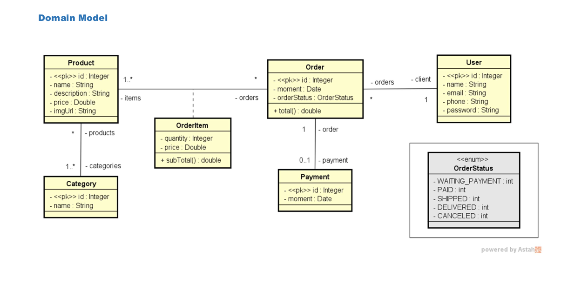
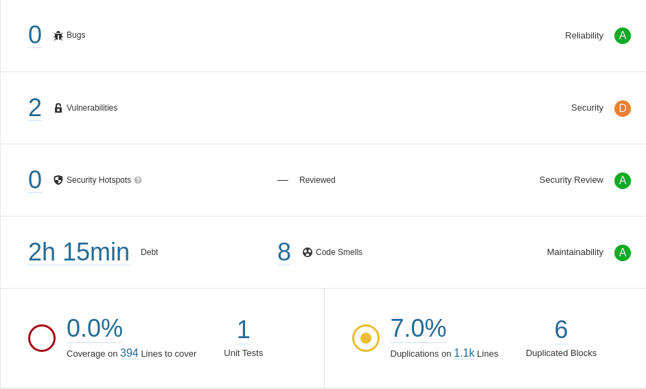

<h1 align="center"><a id="user-content---sobre-o-projeto-" class="anchor" aria-hidden="true" href="#--sobre-o-projeto-"><svg class="octicon octicon-link" viewBox="0 0 16 16" version="1.1" width="16" height="16" aria-hidden="true"><path fill-rule="evenodd" d="M7.775 3.275a.75.75 0 001.06 1.06l1.25-1.25a2 2 0 112.83 2.83l-2.5 2.5a2 2 0 01-2.83 0 .75.75 0 00-1.06 1.06 3.5 3.5 0 004.95 0l2.5-2.5a3.5 3.5 0 00-4.95-4.95l-1.25 1.25zm-4.69 9.64a2 2 0 010-2.83l2.5-2.5a2 2 0 012.83 0 .75.75 0 001.06-1.06 3.5 3.5 0 00-4.95 0l-2.5 2.5a3.5 3.5 0 004.95 4.95l1.25-1.25a.75.75 0 00-1.06-1.06l-1.25 1.25a2 2 0 01-2.83 0z"></path></svg></a> <g-emoji class="g-emoji" alias="computer" fallback-src="https://github.githubassets.com/images/icons/emoji/unicode/1f4bb.png"></g-emoji> About </h1>

<div align="center">


</div>

## Web service project, developed during studies on Webservices using the REST architectural model.

---

Content table
=================
* [About](#about)
* [Content table](#content-table)
* [Domain model](#domain-model)
* [Features](#features)
* [Getting started](#getting-started)
* [Sonar metrics](#sonar-metrics)
* [Techs](#techs)
* [Author](#author)

---


### Domain model



---

### Features
- [x] User CRUD
- [x] List available products
- [x] List product categories
- [x] List orders


---
### Getting started

```bash
# Clone repository
$ git clone https://github.com/eduardowanderleydev/course-springboot-2-java11.git

# go to project directory
$ cd course-springboot-2-java11

# run application
$ mvn spring-boot:run

# The server will start on port:8080
```

---
### Sonar metrics



---
### Techs
The following technologies were used in the construction of the project:

Backend
- [Spring boot](https://spring.io/projects/spring-boot)
- [Spring Data JPA](https://spring.io/projects/spring-data-jpa)
- [H2 Database](https://www.h2database.com/html/main.html)

---
### Author
<a href="https://github.com/eduardowanderleydev">
 
 <br />
 <sub><b>Eduardo Wanderley</b></sub></a>


Contact : 👋🏽

[](https://www.linkedin.com/in/eduardowanderleydev/)
[](mailto:eduardowanderleydev@gmail.com)
[](https://github.com/eduardowanderleydev)
